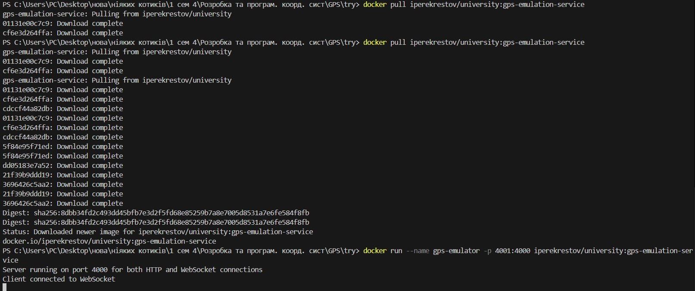
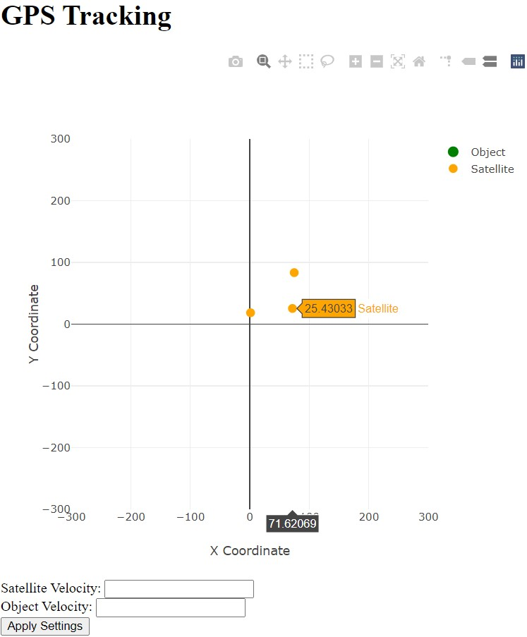
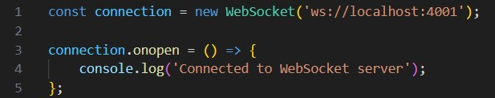
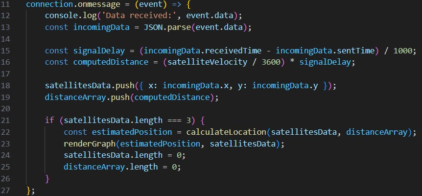
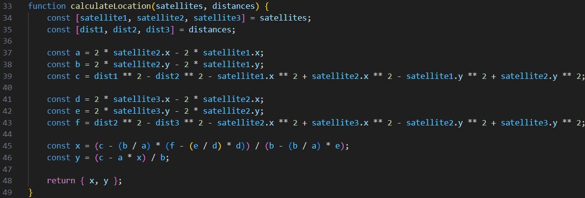
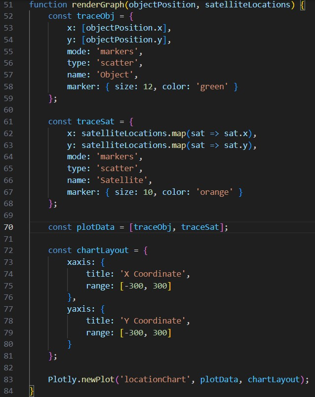
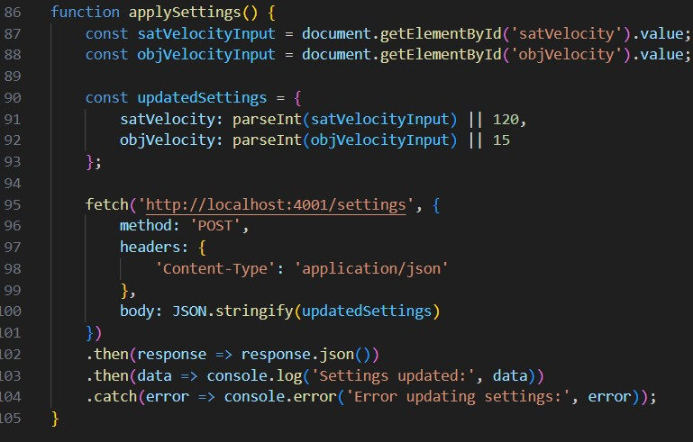

# Розробка додатку для візуалізації вимірювань GPS

Мета роботи

Розробити додаток, який зчитує дані з емульованої вимірювальної частини GPS, наданої у вигляді Docker image, та відображає положення об'єкта і супутників на графіку в декартових координатах.

Завантаження та запуск емулятора вимірювальної частини GPS/

Завантажуємо Docker image з Docker Hub і запускаємо Docker контейнер:

Відображення супутників і об'єкта на графіку:

Підключення до WebSocket сервера:

Ця частина підключається до сервера через WebSocket і відкриває з'єднання. Після успішного підключення виводиться повідомлення в консоль.

Отримання даних від WebSocket:

Ця функція обробляє повідомлення від сервера. Вона отримує дані про супутники, розраховує затримку сигналу і відстань до об'єкта, а потім обчислює його положення (якщо є три супутники) та викликає функцію для оновлення графіку.

Обчислення положення об'єкта:

Ця функція використовує координати супутників і відстані для обчислення координат об'єкта за допомогою методу трилатерації.

Ця функція малює супутники і об'єкт на графіку за допомогою бібліотеки Plotly. Маркери для супутників і об'єкта відображаються різними кольорами, і графік оновлюється щоразу після отримання нових даних:

Функція applySettings для оновлення параметрів:

Ця функція зчитує значення введених користувачем параметрів із полів форми (ID satVelocity та oobjVelocity). Потім вона відправляє ці дані на сервер через запит fetch до ендпоінта /config. Відправляються дані у форматі JSON з новими параметрами для швидкості супутника та об'єкта.
